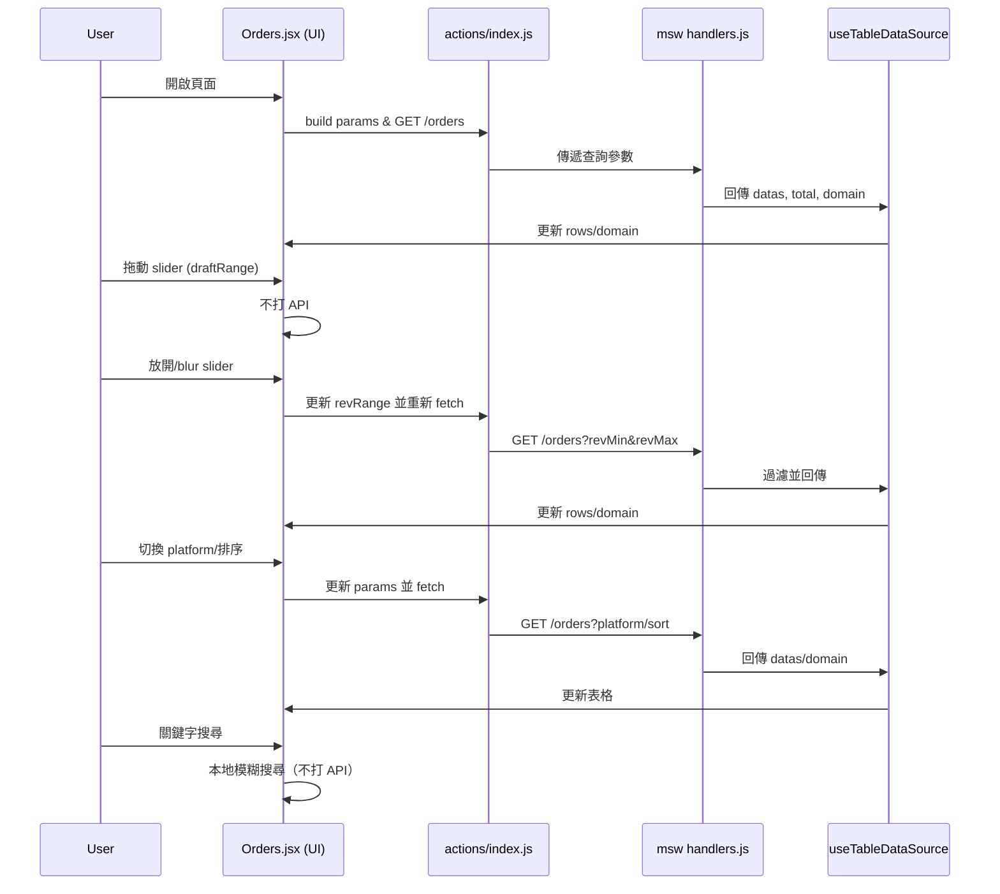
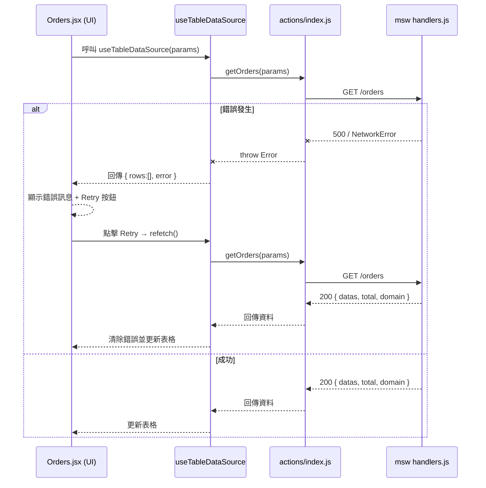

# 二手交易儀表板 — 訂單列表資料流設計

## 資料流（Data Flow）

```
[UI / Orders.jsx]
   │  (build params: { platform, revMin, revMax, sortBy, order })
   ▼
[actions/index.js]  ← 只負責發請求（不變形、不過濾）
   │  GET /orders?platform=...&revMin=...&revMax=...&sortBy=...&order=...
   ▼
[msw handlers.js]  ← 結構化條件過濾 + 排序 + domain 計算
   │  回傳 { datas, total, domain:{ revenueMin, revenueMax } }
   ▼
[useTableDataSource] ← 取回結果提供 rows / total / domain 給 UI
   │  （若 serverMode=true，不在前端再做 range/platform 過濾）
   ▼
[UI / Orders.jsx]
   - 顯示表格、slider（使用 domain 產生滑桿極值）
   - keyword 在前端做模糊搜尋（searchText）
```

---

## 責任邊界（Who does what）

### Orders.jsx（UI）

* 管理狀態：`keyword`、`platform`、`draftRange`（拖動中）、`revRange`（applied）、`sort`。
* **組裝 params**（格式要與後端一致）：

  ```js
  const params = {
    platform,              // 'shopee' | 'ruten' | 'other'（空 = 全部）
    revMin: revRange?.[0], // 只有有值才帶
    revMax: revRange?.[1],
    sortBy: sort?.key,     // 'order_id' | 'sales' | 'revenue' | ...
    order:  sort?.dir      // 'asc' | 'desc'
  };
  ```
* 只把 **keyword** 留在前端做模糊搜尋（用 `col.searchText` 支援中文顯示值）。

### actions/index.js

* 單純把 `params` 丟到 API（或 msw endpoint）。
* 不處理資料變形或過濾（確保責任單一）。

### msw handlers.js（後端/模擬）

* 只處理**結構化條件**：`platform`、`revMin`、`revMax`、`sortBy/order`。
* 回傳計算好的 **domain**（例如 `revenueMin/revenueMax`）。
* 不處理 keyword（讓前端統一模糊搜尋）。

### useTableDataSource（hook）

* `serverMode: true` 時：依 `JSON.stringify(params)` 變更 refetch。
* 將回傳物件中的 `datas/total/domain` 轉給 UI。
* 本地端（client-side）只做 **keyword** 過濾（若你保留這邏輯）。

---

## 互動時序（Range/Sort/Platform）



---

## 錯誤處理/Retry 機制


---

## 關鍵細節（避免踩雷）

* **顯示值 fallback**：`value={draftRange ?? revRange ?? [domain.min, domain.max]}`
* **初始化**：domain ready 且 `revRange` 未設定時 → `setRevRange([domain.min, domain.max])`
* **domain 改變時**：只 **clamp** `revRange`，不要重設，避免滑桿回彈。
* **refetch 依賴**：`deps: [JSON.stringify(params)]`
* **searchText**：`platform` 與 `shipping_fee_payer` 這種顯示值 ≠ 原始值的欄位，要加：

  ```js
  // column 定義示例
  { key: 'platform', searchText: v => PLATFORMS[v] ?? v }
  { key: 'shipping_fee_payer', searchText: v => v==='buyer'?'買家':v==='seller'?'賣家':v }
  ```

---

## 最小參考：handlers.js（重點段落）

```js
// 收入範圍
const revMin = Number(req.url.searchParams.get('revMin'));
const revMax = Number(req.url.searchParams.get('revMax'));
if (!Number.isNaN(revMin)) items = items.filter(x => Number(x.revenue) >= revMin);
if (!Number.isNaN(revMax)) items = items.filter(x => Number(x.revenue) <= revMax);

// 平台
const platform = req.url.searchParams.get('platform');
if (platform) items = items.filter(x => x.platform === platform);

// 排序
const sortBy = req.url.searchParams.get('sortBy');
const order  = req.url.searchParams.get('order'); // 'asc'|'desc'
if (sortBy) {
  const dir = order === 'desc' ? -1 : 1;
  items.sort((a,b)=>{
    const av=a[sortBy], bv=b[sortBy];
    if (av==null||bv==null) return (av==null)-(bv==null)*dir;
    return (typeof av==='number' && typeof bv==='number')
      ? (av-bv)*dir
      : String(av).localeCompare(String(bv))*dir;
  });
}

// domain
const revenueMin = Math.min(...items.map(x=>x.revenue));
const revenueMax = Math.max(...items.map(x=>x.revenue));

return res(ctx.json({ datas: items, total: items.length, domain: { revenueMin, revenueMax } }));
```
